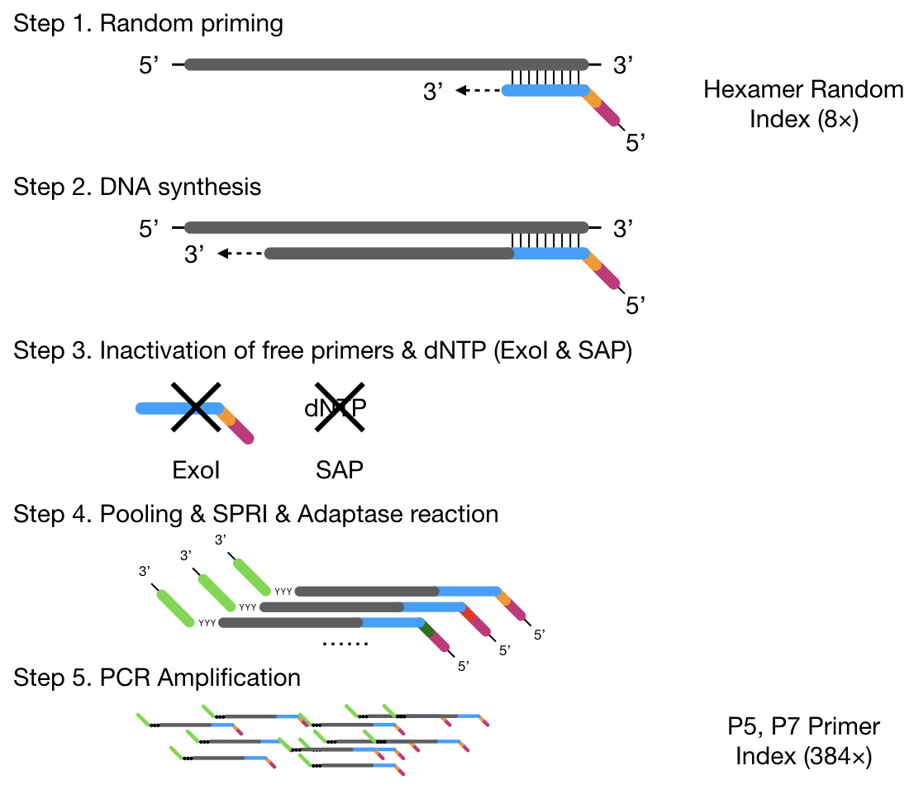
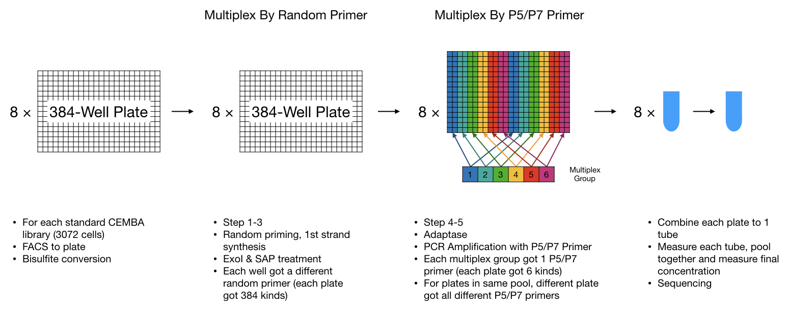
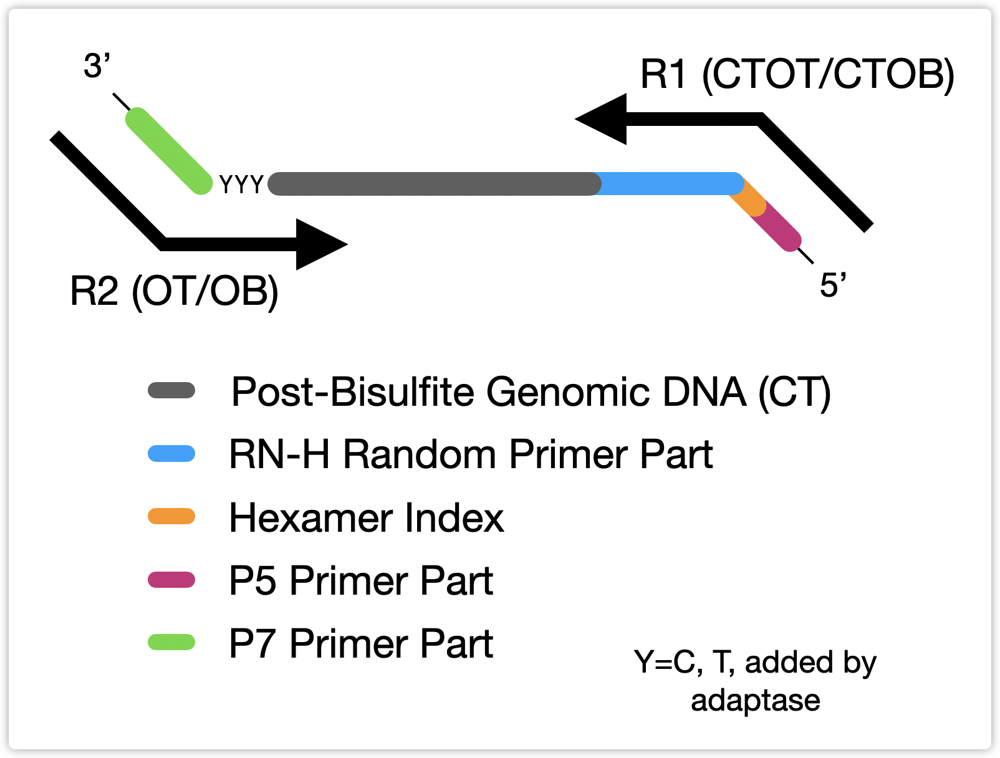
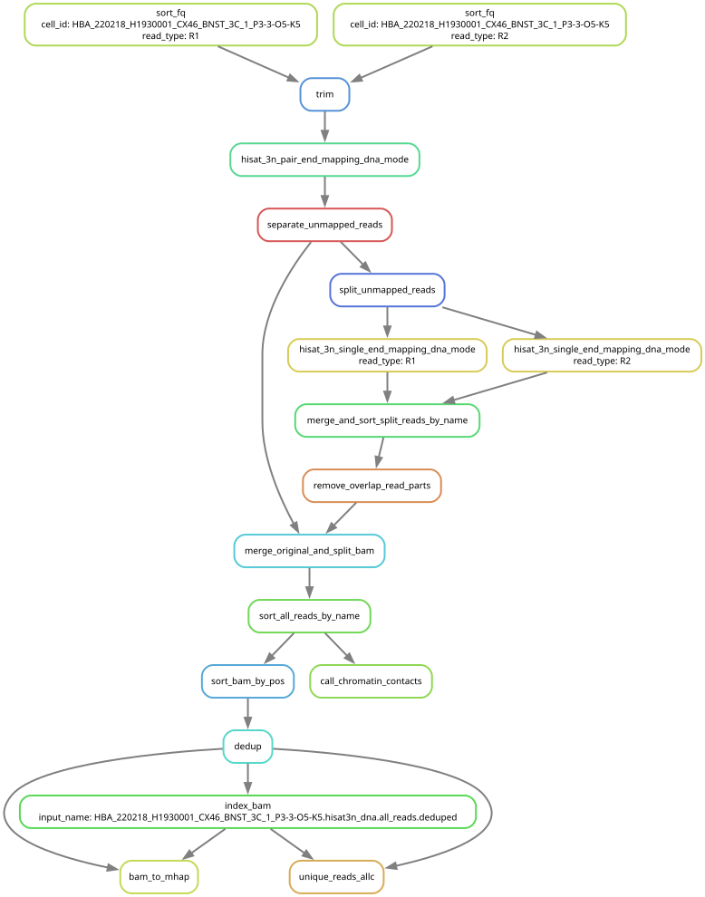

# Description

This is an independent fork of cemba_data to map single cell DNA methylation and multiome data generated using snmc-type technology from J. Ecker lab. Original code is available at https://github.com/DingWB/cemba_data and https://github.com/lhqing/cemba_data . Codebase was significantly trimmed and refactored, bug fixes were introduced. To increase simplicity legacy code focused on V1 barcoding, bismark mapping and cloud integration was dropped. This is **local-only** implementation for **version 2 barcoding** (384 spearate random indexes for each cell on a 384 plate) based on **hisat3n mapping**.

# Installation
## Create environment and install
```shell
conda install -y -n base -c conda-forge mamba
conda config --add channels defaults
conda config --add channels bioconda
conda config --add channels conda-forge

mamba env create -f https://raw.githubusercontent.com/mbatiuk/cemba_data/master/yap.yaml

conda activate yap

```
## Install this fork of cemba_data:
```shell
pip install git+https://github.com/mbatiuk/cemba_data
```

## Reinstall cemba_data after update on github
```shell
pip uninstall -y cemba_data && pip install git+https://github.com/mbatiuk/cemba_data
```

## HISAT-3N Installation
HISAT-3N documentation is available here: https://daehwankimlab.github.io/hisat2/hisat-3n/

HISAT-3N can be built from source:
```shell
git clone https://github.com/DaehwanKimLab/hisat2.git hisat-3n
cd hisat-3n
git checkout hisat3n
make
```
### Temporary add the hisat-3n directory to your PATH
```shell
export PATH=$PWD:$PATH
```

### Permanently add hisat-3n to your PATH, depending on your shell either bash or zsh:
```shell
echo 'export PATH=$PWD:$PATH' >> ~/.bashrc
source ~/.bashrc
```
```shell
echo 'export PATH=$PWD:$PATH' >> ~/.zshrc 
source ~/.zshrc
```

## Build hisat-3n index
### Non-repeat index

```bash
hisat-3n-build --base-change C,T genome.fa hisat
```
### Repeat index
```shell
hisat-3n-build --base-change C,T --repeat-index genome.fa hisat
```

### Repeat HISAT-3N integrated index with splice site information
```shell
hisat-3n-build --base-change C,T --repeat-index \
    --ss genome.ss --exon genome.exon genome.fa hisat
```

### Index for RNA
```shell
hisat2-build -p 16 genome.fa hisat_rna
```

# Usage


## Generate config.ini

### m3c - DNA methylation+ 3C
```shell
yap default-mapping-config --mode m3c \
    --genome_fasta "~/genomes/mus/mm10_chrL.fa" \
    --chrom_size_path "~/genomes/mus/mm10.sizes" \
    --hisat3n_dna_ref  "~/genomes/mus/hisat/hisat" > m3c_config.ini
```

### mc - DNA methylation
```shell
yap default-mapping-config --mode mc \
    --genome_fasta "~/genomes/mus/mm10_chrL.fa" \
    --chrom_size_path "~/genomes/mus/mm10.sizes" \
    --hisat3n_dna_ref  "~/genomes/mus/hisat/hisat" > mc_config.ini
```

### mct - DNA methylation + RNA
```shell
yap default-mapping-config --mode mct \
    --hisat3n_dna_ref "~/genomes/mus/hisat/hisat" \
    --hisat3n_rna_ref "~/genomes/mus/hisat_rna/hisat_rna" \
    --genome_fasta "~/genomes/mus/mm10_chrL.fa" \
    --chrom_size_path "~/genomes/mus/mm10.sizes" \
    --gtf "~/genomes/mus/gencode.vM23.annotation.gtf" > mct_config.ini
```

### mc nome - DNA methylation + NOMe
```shell
yap default-mapping-config --mode mc --nome \
    --genome_fasta "~/genomes/mus/mm10_chrL.fa" \
    --chrom_size_path "~/genomes/mus/mm10.sizes" \
    --hisat3n_dna_ref "~/genomes/mus/hisat/hisat" > mc_nome_config.ini
```

### mc-multi - multi-mapping reads retained during mc
```shell
yap default-mapping-config --mode mc-multi \
    --genome_fasta "~/genomes/mus/mm10_chrL.fa" \
    --chrom_size_path "~/genomes/mus/mm10.sizes" \
    --hisat3n_dna_ref "~/genomes/mus/hisat/hisat" > mc_multi_config.ini
```

### mc-multi nome - multi-mapping reads retained during mc + NOME
```shell
yap default-mapping-config --mode mc-multi --nome\
    --genome_fasta "~/genomes/mus/mm10_chrL.fa" \
    --chrom_size_path "~/genomes/mus/mm10.sizes" \
    --hisat3n_dna_ref "~/genomes/mus/hisat/hisat" > mc_multi_config.ini
```

### mct-multi - multi-mapping reads retained during mct
```shell
yap default-mapping-config --mode mct-multi \
    --genome_fasta "~/genomes/mus/mm10_chrL.fa" \
    --hisat3n_dna_ref "~/genomes/mus/hisat/hisat" \
    --hisat3n_rna_ref "~/genomes/mus/hisat_rna/hisat_rna" \
    --gtf "~/genomes/mus/annotation.gtf" \
    --chrom_size_path "~/genomes/mus/mm10.sizes" > mct_multi_config.ini
```

### mct-multi nome - multi-mapping reads retained during mct + NOME
```shell
yap default-mapping-config --mode mct-multi --nome\
    --genome_fasta "~/genomes/mus/mm10_chrL.fa" \
    --hisat3n_dna_ref "~/genomes/mus/hisat/hisat" \
    --hisat3n_rna_ref "~/genomes/mus/hisat_rna/hisat_rna" \
    --gtf "~/genomes/mus/annotation.gtf" \
    --chrom_size_path "~/genomes/mus/mm10.sizes" > mct_multi_config.ini
```

**Attention**, `--hisat3n_dna_ref` expects prefix of each hisat genome file, not the directory path.
If genome index directory `~/genomes/mus/hisat/` contains files `hisat.3n.CT.1.ht2` `hisat.3n.CT.2.ht2` etc you need to specify `--hisat3n_dna_ref "~/genomes/mus/hisat/hisat"` in the command.

Note that NOMe variants are invoked by adding the `--nome` flag to the base mode during configuration generation.

During NOMe variant the GCH contain open chromatin information, HCN contain normal methylation information. An additional one base is added in the context column of ALLC, so we can distinguish GpC sites with HpC sites.


### Supported Modalities

| Modality | Configuration Command |
| :--- | :--- |
| **`m3c`** | `yap default-mapping-config --mode m3c ...` |
| **`m3c-multi`** | `yap default-mapping-config --mode m3c-multi ...` |
| **`mc`** | `yap default-mapping-config --mode mc ...` |
| **`mc nome`** | `yap default-mapping-config --mode mc --nome ...` |
| **`mc-multi`** | `yap default-mapping-config --mode mc-multi ...` |
| **`mc-multi nome`** | `yap default-mapping-config --mode mc-multi --nome ...` |
| **`mct`** | `yap default-mapping-config --mode mct ...` |
| **`mct nome`** | `yap default-mapping-config --mode mct --nome ...` |
| **`mct-multi`** | `yap default-mapping-config --mode mct-multi ...` |
| **`mct-multi nome`** | `yap default-mapping-config --mode mct-multi --nome ...` |


## Prepare FASTQ files by linking them with correct naming convention

Raw sequencer outputs often have complex or inconsistent naming conventions. Use `link-fastq` to create symbolic links with standardized names: `{plate}-{multiplex_group}_{lane}_{read_type}.fastq.gz`.

Make sure original raw fastq file names follow these minimal expectations:
- `plate` name must not contain `-` characters. If by mistake `-` is present it will be converted to `.`
- `multiplex_group` is absent or an integer 1–6
- `lane` must contain number. `L1`, `1`, `L001`, `l10`, or even `L10000` will be standardized to `L001`, `L010` or `L10000`
- `read_type` must contain `1` or `2` for correct standardization into `R1` and `R2`


```shell
yap link-fastq \
    --in_fq_dir "raw_fastq_dir" \
    --out_fq_dir "fastq" \
    --plate_pattern "([a-zA-Z0-9]+)" \
    --read_type_pattern "(R[12])" \
    --multiplex_group_pattern "(\d+)" \
    --lane_pattern "L\d+" \
    --recursive
```

**Parameters:**
- `-i` / `--in_fq_dir`: (**required**) Input directory containing raw FASTQ files.
- `-o` / `--out_fq_dir`: (**required**) Output directory for standardized FASTQ symlinks.
- `-p` / `--plate_pattern`: (**required**) Regex to extract plate name. Use `()` to capture a sub-portion; without `()` the full match is used.
- `-r` / `--read_type_pattern`: Regex for R1/R2. Default: `(R[12])`. The matched value must contain `1` or `2`.
- `-g` / `--multiplex_group_pattern`: (optional) Regex for multiplex group. Use `()` to capture a sub-portion; without `()` the full match is used. If absent, `1` is used for all files.
- `--lane_pattern`: (optional) Regex to extract lane from filename. Use `()` to capture a sub-portion; without `()` the full match is used. Ignored if `--lane` is set.
- `-l` / `--lane`: (optional) Manually assign a lane name to all files in `in_fq_dir`. If you have files from multiple sequencing runs of the same library pool you can call `link-fastq` separately per run and use `--lane` to assign a distinct lane name to each run. The pipeline will then merge fastq files correctly. `L001` is used when neither `--lane_pattern` nor `--lane` is provided.
- `--recursive`: Search `in_fq_dir` recursively for FASTQ files.

### How to write patterns (Regular Expressions)

The tool uses Regular Expressions (regex) to find metadata in filenames. If the pattern contains parentheses `()`, only the part inside is extracted. Without `()`, the entire match is used as the value.

For example, to extract the multiplex group from `Sample_1_L001_R1.fq.gz`:
- `--multiplex_group_pattern "_\d+_"` — matches `_1_`; the full match `_1_` is used as the value.
- `--multiplex_group_pattern "_(\d+)_"` — underscores are context; only `1` inside `()` is extracted.

Use `()` when you need to strip surrounding delimiters or context from the value.

### Common examples of patterns

| Field | Pattern | Extracted value |
| :--- | :--- | :--- |
| **Plate** | `^([a-zA-Z0-9]+)` | Everything alphanumeric at start of filename |
| **Plate** | `([^-_]+)` | Everything until first `-` or `_` |
| **Read Type** | `(R[12])` | `R1` or `R2` (default, usually no need to change) |
| **Lane** | `(L\d+)` | `L001`, `L002`, etc. |
| **Multiplex Group** | `-(\d+)-` | Number between two hyphens |

### Regex quick reference

| Symbol | Meaning | Example |
| :--- | :--- | :--- |
| `.` | Any single character (except newline) | `P.ate` matches `Plate` or `P1ate` |
| `\d` | Any digit (0-9) | `\d+` matches `1` in `123` |
| `\w` | Any word character (letter, digit, or `_`) | `\w` matches `P` in `Plate` |
| `\s` | Any whitespace character | rarely needed in filenames |
| `[abc]` | Any one of the listed characters | `[abc]` matches `a`, `b`, or `c` |
| `[a-zA-Z0-9]` | Any letter or digit | matches `P` in `Plate` or `1` in `123` |
| `[^_-]` | Any character **except** those listed | `[^_-]` captures any character except `-` or `_` |
| `^` | Start of string | `^025` matches `025` only at start |
| `$` | End of string | `\.fastq\.gz$` matches only at end |
| `\|` | Alternation — match either side | `R1\|R2` matches `R1` or `R2` |
| `*` | Zero or more of the preceding | `\d*` matches `` or `123` |
| `+` | One or more of the preceding | `\d+` matches `1` and `123`, not empty |
| `?` | Zero or one of the preceding (optional) | `colou?r` matches `color` or `colour` |
| `{n}` | Exactly n repetitions | `\d{3}` matches exactly `001` |
| `{n,m}` | Between n and m repetitions | `\d{1,3}` matches `1`, `12`, or `123` |
| `()` | Capturing group — **only this part is extracted** | `_(\d+)_` extracts `1` from `_1_` |
| `\.` | Literal dot (escape special characters with `\`) | `\.fastq` matches `.fastq`, not `Xfastq` |


## Demultiplex

```shell
yap demultiplex --fq_dir "fastq_dir" \
    --output_dir "your_cell_level_directory" \
    --config_path "m3c_config.ini" \
    --n_jobs 16 --print_only
```

`--config_path` - path to the `.ini` config file generated by `yap default-mapping-config`. If provided, `total_read_pairs_min` and `total_read_pairs_max` are read from it and passed to the demultiplex pipeline, overriding the built-in defaults (`1` and `10000000`). If omitted, built-in defaults apply.

`--print_only` - prints demultiplex snakemake command but does not start it interactively

## Mapping


### Generate snakemake, sbatch and qsub scripts to start the mapping
```shell
yap mapping --output_dir "your_cell_level_directory" \
    --config_path "m3c_config.ini" --n_jobs 62 --total_memory_gb 400 \
    --qos "serial" --conda_base "mamba" --print_only
```
`--n_jobs` - amount of parallel jobs and requested cpu cores if run using sbatch

`--total_memory_gb` - total RAM memory requested, either per HPC node or locally

`--qos` - QOS option passed to sbatch script if run on HPC. This is HPC dependent

`--conda_base` - type of conda installation if using sbatch
  Accepted values are "mamba", "mambaforge", "conda", "miniconda", "anaconda", "miniforge", "miniforge3"
  If loaded as a module on HPC specify "module <module_name>", e.g. "module mamba"
  You can also provide custom path to your conda installation e.g. "/custom/path/to/conda.sh"

`--print_only` - writes snakemake, sbatch and qsub scripts into your_cell_level_directory/snakemake/

### Run mapping from generated script files
```shell
bash your_cell_level_directory/snakemake/qsub/snakemake_cmd.txt
```
```shell
bash your_cell_level_directory/snakemake/sbatch/sbatch-serial-qos.sh
```

### Run mapping interactively in the current shell
```shell
yap mapping --output_dir "your_cell_level_directory" \
    --config_path "m3c_config.ini" --n_jobs 14 --total_memory_gb 32
```

# Background on library preparation and structure

## Library preparation
384 random index primers are used, so each well on 384 well plates receives separate unique random index



## Version 2 barcoding strategy
Please note 1 single PCR index primer can be used for the whole 384 well plate, in this case there will be only one multiplex group



## Library structure



# Workflow of m3c run


# QC metrics, snm3C-seq

| Field | Purpose |
|-------|---------|
| cell | The unique identifier for each cell. |
| InputReadPairs | Total number of reads input into Cutadapt for processing. |
| InputReadPairsBP | Total number of base pairs in the input reads. |
| TrimmedReadPairs | Number of reads that were written to the output after trimming and filtering |
| R1WithAdapters | Number of reads that contained adapter sequences that were detected and trimmed. |
| R1QualTrimBP | Number of R1 base pairs trimmed due to low base quality. |
| R1TrimmedReadsBP | Number of R1 base pairs remaining after adapter and quality trimming. |
| R2WithAdapters | Number of reads from the second mate in paired-end reads that contained adapter sequences and were trimmed. |
| R2QualTrimBP | Number of R2 base pairs trimmed due to low base quality. |
| R2TrimmedReadsBP | Number of R2 base pairs remaining after adapter and quality trimming. |
| UniqueMappedReads | Number of uniquely mapped reads: PEUniqueMappedReadPairs (Aligned concordantly or discordantly 0 time) + PEDiscordantlyUniqueMappedReadPairs (Aligned discordantly 1 time) + SEUniqueMappedReads (Aligned 1 time unpaired reads) |
| UniqueMappingRate | Rate of unique read mapping (total_reads = ReadPairsMappedInPE * 2 + ReadsMappedInSE) |
| MultiMappedReads | Number of multimapped reads. |
| MultiMappingRate | Rate of multimapping. |
| OverallMappingRate | Rate of mapping for all reads (UniqueMappingRate + MultiMappingRate) |
| R1UniqueMappedReads | Number of uniquely mapped R1 reads. |
| R1UniqueMappingRate | Rate of unique R1 read mapping. |
| R1MultiMappedReads | Number of multimapped R1 reads. |
| R1MultiMappingRate | Rate of R1 read multimapping. |
| R1OverallMappingRate | Rate of mapping for all R1 reads. |
| R2UniqueMappedReads | Number of uniquely mapped R2 reads. |
| R2UniqueMappingRate | Rate of unique R2 read mapping. |
| R2MultiMappedReads | Number of multimapped R2 reads. |
| R2MultiMappingRate | Rate of R2 read multimapping. |
| R2OverallMappingRate | Rate of mapping for all R2 reads. |
| UniqueAlignFinalReads | Final unique mapped total reads after picard deduplication |
| UniqueAlignDuplicatedReads | Paired and unpaired duplicated reads |
| UniqueAlignPCRDuplicationRate | FinalReads /(FinalReads + DuplicatedReads) |
| CisContacts | Number of chromatin contacts where the two loci are on the same chromosome. |
| CisCutContacts | No. of read pairs that are split from the same read at the cut site, and map to the same chromosome |
| CisMultiContacts | CisContacts read pair contains multiple read contacts |
| CisCutMultiContacts | CisCutContacts read pair contains multiple read contacts |
| TransContacts | Number of chromatin contacts where the two loci are on different chromosome. |
| TransCutContacts | No. of read pairs that are split from the same read at the cut site, and map to different chromosomes |
| TransMultiContacts | TransContacts read pair contains multiple read contacts |
| TransCutMultiContacts | TransCutContacts read pair contains multiple read contacts |
| ChimericContacts | two reads that are split from the same read, but not at the cut site, this might be due to artificial chimeric synthesis event |
| NoContacts | Not a contact |
| MappedFragments | Total No. of mapped fragments |
| DeduppedContacts | Total No. of deduplicated contacts |
| ContactsDeduplicationRate | (input_contacts - dedup_contacts) / (input_contacts + 0.00001) |
| TotalCisContacts | Total number of cis contacts |
| TotalTransContacts | Total number of trans contacts |
| TotalMultiContacts | Total number of multi contacts (read pair contains multiple read contacts) |
| CisContactsRatio | TotalCisContacts / No. of mapped fragments |
| TransContactsRatio | TotalTransContacts / No. of mapped fragments |
| MultiContactsRatio | TotalMultiContacts / No. of mapped fragments |
| mCCCmC | Total methylated cytosine in the CCC context. |
| mCGmC | Total methylated cytosine in the CG context. |
| mCHmC | Total methylated cytosine in the CH context. |
| mCCCCov | Total covered cytosine in the CCC context. |
| mCGCov | Total covered cytosine in the CG context. |
| mCHCov | Total covered cytosine in the CH context. |
| mCCCFrac | Fraction of methylated cytosine (mCCCmC) divided by covered cytosine (mCCCCov) in the CCC context. |
| mCGFrac | Fraction of methylated cytosine (mCGmC) divided by covered cytosine (mCGCov) in the CG context. |
| mCHFrac | Fraction of methylated cytosine (mCHmC) divided by covered cytosine (mCHCov) in the CH context. |
